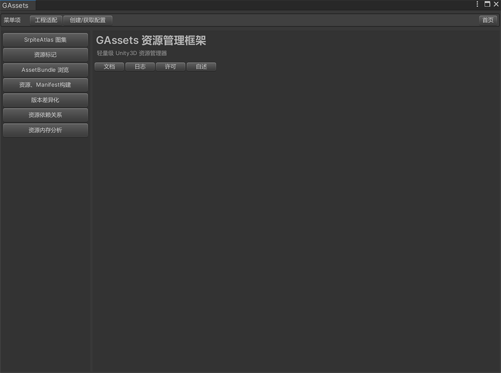
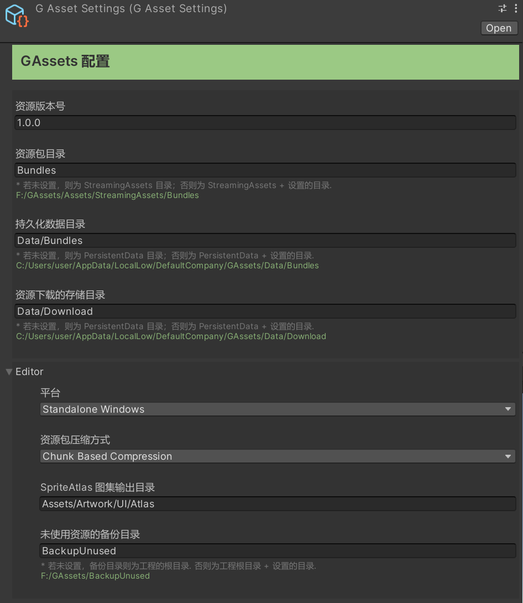

轻量级 Unity3D 资源管理器。

## 目录结构 ##
> Documentation 文档目录

> Editor 编辑工具

> Runtime 运行时脚本

> CHANGELOG.md 日志

> LICENSE.md 许可

> package.json 包配置

> README.md 信息

## 注意事项 ##
1. 资源命名全部为小写，可有字母、数字及下划线组成
2. 每个资源的名称应保证在工程内唯一
3. 不允许修改 AssetBundle 资源包文件名，并且文件名为小写

## Editor 使用说明 ##
资源管理器所有编辑工具都集成在统一的面板中。选择**【Window】->【GAssets】**打开，也可使用快捷键 **Shift + Alt + X** 快速打开。

>

首次使用需执行两步必要操作。操作如下：
>1. 点击菜单项中的 **“工程适配”** 按钮，对当前工程进行适配以兼容 GAssets 资源管理器。
>2. 执行完毕之后，再点击 **“创建/获取配置”** 按钮，创建资源管理器的配置，此配置用于编辑模式及运行时模式。创建完毕后，会在 ***Assets/Resources*** 目录下生成。**请注意，不允许修改此配置文件的文件名，也不允许将此文件移动到其他目录！**因为，在运行时，管理器会自动加载此配置文件执行相关的逻辑操作。

资源管理器配置如下:

>

>可对此配置进行自定义修改。若当前修改配置的同时，操作面板也处于打开状态，修改配置完毕后，建议点击 **“创建/获取配置”** 按钮对配置进行重载。

## Runtime 使用说明 ##
资源框架在运行时（Editor & Build）状态下，所有资源必须以 AssetBundle 形式加载，且必须生成 Manifest 清单文件。  
>
> **资源管理器中的主要文件**  
> *GAssetManager*   资源管理器。负责初始化、平台兼容等相关操作  
> *GAssetManifest*  资源清单。负责管理资源及依赖项的映射  
> *GAssetSettings*  资源配置。包含资源存储、打包等相关的设置  
> 
**资源框架启动及初始化直接调用如下脚本：**    
> `GAssetManager.Ins.LoadManifest(() => { });`  
> 
**对于纯资源加载，调用以下脚本：**   
> `GAssetLoader.LoadAsync`   // 异步加载资源  
> `GAssetLoader.Load`        // 同步加载资源  
> `GAssetLoader.LoadSubAssets`   // 同步加载复合资源  
> `GAssetLoader.LoadSubAssetsAsync`  // 异步加载复合资源  
>
**对于异步创建对象及加载对应的资源，调用以下脚本：**  
> `GInstanceOperate.Create` // 异步加载 Prefab 对象  
> `GSceneOperate.Create("scene2")` // 异步加载 Scene 对象
>
**资源下载，调用以下脚本:**  
> `GDownload.Excute("远程http/https地址", (pro, speed, size) => {})`  
> 其中回调委托函数中的参数分别为：当前下载进度、当前下载速度、文件总尺寸
>
**如果想实现逻辑的异步操作，可使用资源框架下的自动分帧异步组件来实现。调用方式如下：**  
> `GAsyncCom.Excute`
