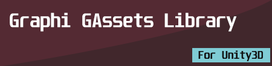

# GAssets Documentation

Lightweight asset management library for Unity3D.

## Directory Structure ##
> Documentation
>> images

>> gmth.md

> Editor
>> cngraphi.gassets.editor.asmdef

> Runtime
>> cngraphi.gassets.asmdef

> CHANGELOG.md

> LICENSE.md

> package.json

> README.md